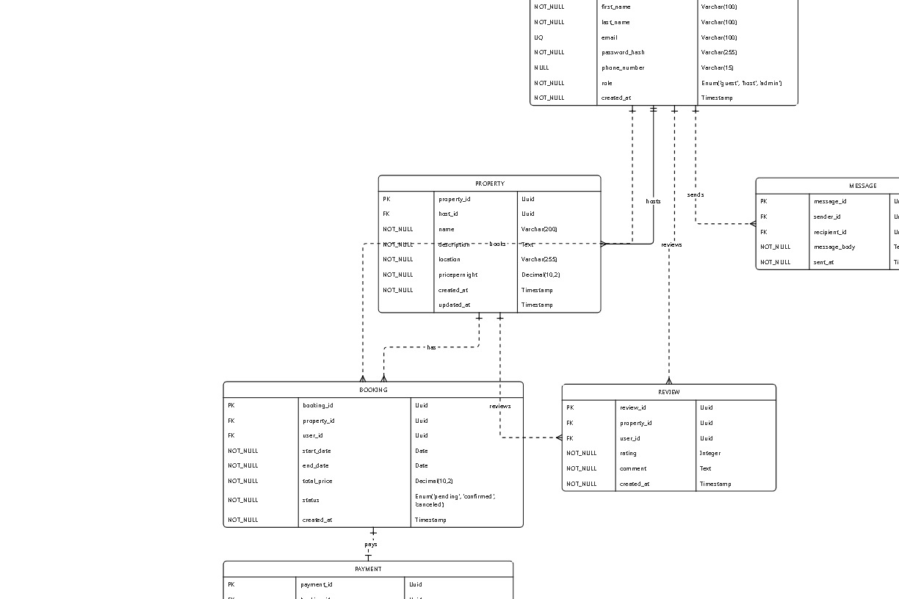

# Entity-Relationship Diagram (ERD)

## Overview
This directory contains the Entity-Relationship Diagram (ERD) for the **Airbnb Database Project**.  
The ERD visually represents the relationships between entities such as **Users**, **Listings**, **Reservations**, and **Reviews**.

---

## Diagram

---

## Entities and Relationships

### **Users**
- Stores all platform users (hosts and guests).
- Primary Key: `user_id`.

### **Listings**
- Properties created by hosts.
- Each listing belongs to exactly one user (host).
- Primary Key: `listing_id`.
- Foreign Key: `host_id → users.user_id`.

### **Reservations**
- Represents bookings made by guests.
- Linked to both a guest (user) and a listing.
- Primary Key: `reservation_id`.
- Foreign Keys:
  - `listing_id → listings.listing_id`
  - `guest_id → users.user_id`

### **Reviews**
- Feedback provided by guests after completing a reservation.
- Each reservation can only have one review.
- Primary Key: `review_id`.
- Foreign Key: `reservation_id → reservations.reservation_id`.

---

## Notes
- **One-to-Many**: A user (host) can have many listings.  
- **One-to-Many**: A user (guest) can have many reservations.  
- **One-to-One**: A reservation can have at most one review.  
- Constraints (e.g., unique, not null, checks) are enforced in the schema (`schema.sql`).  

---

## Usage
This ERD is intended for **manual review** of the database design to ensure:
- Proper normalization.
- Accurate representation of business rules.
- Correct foreign key relationships.
